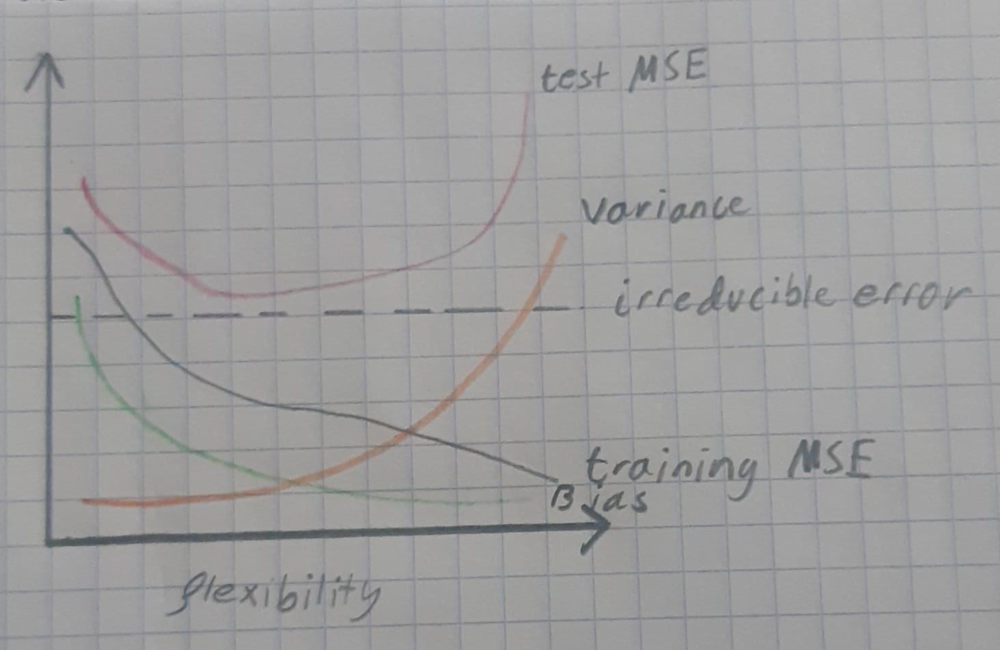

### Chapter 2 Exercises
## Conceptual
#1)
a) A more flexible method is better. As there is a larger sample size, noise is easier to discern reducing the risk of overfitting. The low number of predictors also means that using a more flexible method will not severly reduce the interpretability of the model, reducing the usual tradeoff between the latter and a better fit to the training data.
b)A less flexible method is better. Given the number of predictors and the few samples, a highly flexible method is much more likely to overfit the data as the lack of samples will make it find trends that are a result of noise.
c)A more flexible method is more ideal here as the true relationship between the predictors and response seems to be non-linear. As a result the flexible method will help greatly reduce the bias generated in our model. 
d) A less flexible method is better. The high variance in the irreducible error indicates that the more flexible method is overfitting to the noise found in each training set. 

#2)
a)This is a regression problem as we have a clear set of predictors (profit, number of employees, industry) and a numerical response (CEO salary). Given the objective to identify what predictors are affecting the response, this is an *inference* problem. 
n = 500 ; p = 3
b)This is a classification problem as our response is categorical (success or failure). This is a *prediction* problem as the goal is to determine if a product is a success or failure based on the predictors. 
n = 20 ; p = 13 
c) This is a regression problem as the response is numerical (% change in USD/EURO exchange rate).This is a *prediction* problem as the goal is to predict the future % change in the USD/Euro exchange rate. 
n = 52 ; p = 3

#3)
a)
``` {r load image, echo = TRUE}

```
b)
test MSE: As flexibility increase, test MSE initially decreases as the increased flexibility better fits the true relationship of the data. However, as it increases further, test MSE will plateau and increase as the method begins to overfit the training data.

training MSE: Training MSE monotonically decreases with increasing flexibility as the methods gradually fit the training data better (and overfit it).

Irreducible error: This error is constant as it is a result of the predictors that we have not measured but contribute to the response.

Variance: This monotonically increases with flexibility as the overfitting of the training data prevents the model from reliably predicting response in test data.

Bias: This monotonically decreases as flexibility increases as the method is more capable of fitting the training data. 


#4)

a)
1 - Cell type classification: the response here is the cell type and the predictors are gene expression. Generally, the goal is prediction (although inference would the goal when trying to understand what genes lead to a cell type) as we want to use the measured gene expression to know what cell type the cell belongs to.
2 - Animal classification: the response is the animal and the predictors are physical traits (i.e. fur,number of legs,scales, horns etc.). The goal here is prediction as we want to identify what the animal is. 
3 - Identifying students that will be hired after graduation: the response is whether the student was hired and the predictors are metrics related to academics and extracurricular activities. This would be an inference problem asked by an academic institution to know what factors contribute to a student's ability to be hired. With this, the institution could infer what aspects of their programs to develop to increase the success rate of their alumni.

b)
1- Lemonade stand sales: response is the total sales in one day and predictors are weather, temperature and season. This could be an inference problem to know how each predictor affects the response, and therefore know what the ideal conditions are for optimal sales. Alternatively, this could be a prediction problem to anticipate how many sales will be made in the future, and therefore know how much produce to buy beforehand to reach it.
2- Amount of snowfall: response is snowfall in centimeters and predictors are temperature, humidity, and number of consecutive snowless days. This is a prediction problem as we want to know how much snow will fall in the future.
3- Estimated traffic time: response is traffic time and predictors are time of day, day of the week and season. This is a prediction problem as we want to know how much time we are expected to be in traffic in the future. This could be an inference problem if we are interested in knowing what predictors contribute most to traffic time and therefore which ones to use to avoid traffic.

c)
1- Genetic study of disease: enables us to determine if the gene expression of individuals is distinct based on the presence of absence of a disease.
2- Political campaign: Can use surveys to determine if different demographics have distinct issues that they prioritize.
3- Ad recommendations: Identify demographics that like/buy similar products and share ads that other people in the same cluster have clicked on.

#5)

A very flexible approach helps ensure our model better fits the relationship found in the data. This can lead to a more accurate prediction than a less flexible method. These methods are also much better at reducing bias. However, more flexible methods are also more likely to overfit the data by misinterpreting noise as part of the relationship whereas less flexible methods do not have this issue. A more flexible approach may be more desirable in cases where our goal is simply prediction and/or the data does not seem to have a truly linear relationship. A less flexible approach is more desirable when the goal is inference as it makes the model more interpretable. It may also be valuable in training sets with low sample numbers as it is less likely to overfit.

#6)
Parametric approaches focus on reducing the prediction of a response to measuring a set of predictors and applying them to a function f(x).
Non-parametric approaches do not make any assumptions about the actual form of f(x).
The advantage of parametric approaches is that it needs a lot less observations to generate an accurate model of f than non-parametric methods as it reduces f(x) to a selection of predictors. However, the disadvantage of parametric methods is that they assume that f(x) has a particular form, which will not exactly match the true f meaning our model could have a very large bias if the wrong assumption is made.

#7)

a)   
      Obs.   X1   X2   X3  Distance            Y
       ---------------------------------------------
       1      0    3    0   3                 Red 
       2      2    0    0   2                 Red
       3      0    1    3   sqrt(10)          Red
       4      0    1    2   sqrt(5)           Green
       5     -1    0    1   sqrt(2)           Green
       6      1    1    1   sqrt(3)           Red
b) Green - nearest observation is observation 5 with a euclidean distance of sqrt(2). As this observation is Green, so is our test point
c) Red - two of the three nearest observations are classed as Red. Therefore, so is the test point.
d) As K is inversely proportional to flexibility and non-linear relationships are better estimated by flexible methods, this model would need a low K to retain accuracy. 

## Applied

#8)
```{r Q8, echo=TRUE}
college <- read.csv("../datasets/College.csv")
rownames(college) <- college[,1]
college <- college[,-1]
college[,1] <- as.factor(college[,1])
# For Private Column: private -> 2, public -> 1
head(college)
summary(college)

#Scatterplot matrix of the first ten variables
tmp <- college
tmp[,1] <- as.numeric(college[,1])
pairs(tmp[,1:10])

#Private vs. Out-of-state tuition boxplot
plot( x = college$Private, y = college$Outstate,xlab = "Private Institution", ylab = "Out-of-State Tuition (USD)", main = "Out-of-State Tuition Boxplot")

college$Elite <- as.factor(ifelse(college$Top10perc > 50, "Yes", "No"))
summary(college)

#Histograms
par(mfrow= c(2,2))
hist(college$Apps,col = 2, ylab = "Counts", xlab = "Number of Applicants" )
hist(college$PhD, col = 3, ylab = "Counts", xlab = "% of Faculty with PhDs" )
hist(college$Grad.Rate, col = 5, ylab = "Counts", xlab = "Graduation Rate" )
hist(college$F.Undergrad, col = 8, ylab = "Counts", xlab = "Number of Full-Time Undergrads" )

##Observations
#skewed distribution of PhD holders in faculty positions
#Normal distribution for graduation rates
#Reviewing summary statistics shows anomalies in Graduation rate and PhD variables where there are values above 100%
unique(c(rownames(college)[college$PhD > 100],rownames(college)[college$Grad.Rate > 100]))
#The two erroneous values concern Texas A&M and Cazenovia College

```

#9)

``` {r Q9, echo = TRUE}
car <- read.csv("../datasets/Auto.csv")
car[car == "?"] <- NA
car <- na.omit(car)
head(car)
#mpg, cylinders, displacement,weight, horsepower and acceleration are quantitative traits whereas year, origin and name are categorical

dim(car)

sapply(car[,c(1:3,5,6)],range)
sapply(car[,c(1:3,5,6)],mean)
sapply(car[,c(1:3,5,6)],sd)

subset_car <- car[-c(10:85),c(1:3,5,6)]
sapply(subset_car,range)
sapply(subset_car,mean)
sapply(subset_car,sd)


#Exploration
car$horsepower <- as.numeric(car$horsepower)
car$name <- as.factor(car$name)
pairs(car)

##Observations
# The categorical traits show little correlation with the quantitative traits
#Many of the correlations between the quantitative traits show linear trends when displacement, horsepower, or weight are one or both of the variables
#Based of the scatterplots, displacement, horsepower and weight may be the best predictors for mpg as they display linear correlations with mpg. 
```
#10)

``` {r Q10, echo = TRUE}
library(MASS)
dim(Boston)
#Dataset contains 506 rows and 14 observations
head(Boston)
pairs(Boston)

nrow(Boston[Boston$chas == 1,])
median(Boston$ptratio)
rownames(Boston[Boston$medv == min(Boston$medv),])


nrow(Boston[Boston$rm > 7,])
nrow(Boston[Boston$rm > 8,])
summary(Boston[Boston$rm > 8,])
#Suburbs with more than 8 rooms per dwelling have a very low crime rate, and a lower ptratio and lstat
#The medv is also double that of the entire city
```


