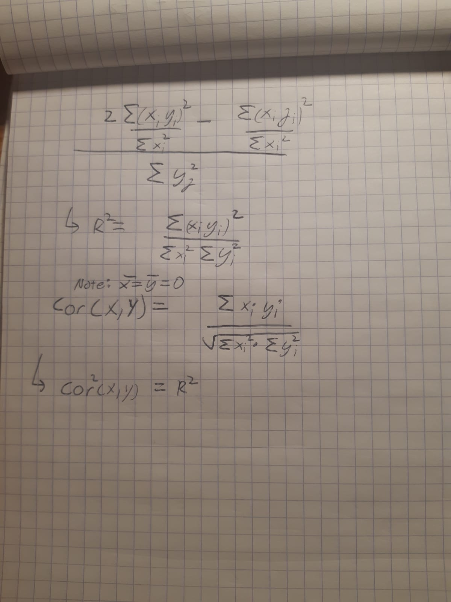

# Conceptual


### 1)

  Table 3.4 shows basic stats from  the linear model for the
  estimation of the number of units sold given the advertising budgets for (the 
  predictors): *TV, radio and newspaper*. The null hypotheses the p-values 
  correspond to are that there is no link between the budgets of each form of
  advertisement and the number of units sold ( == the coefficients of the 
  predictors are equal to 0).
  
  Based on this relationship, the p-values indicate that the null hypotheses for
  both the TV and radio budgets' relationship to sales can be rejected. However,
  the null hypothesis for newspaper must be accepted as its p-value is much
  larger than 0.05. We would therefore conclude that TV and radio budgets are 
  two predictors worth using to estimate sales.
  
### 2) 

  The KNN classifier will be used to estimate a qualitative response,  (a 
  category). This functions as a conditional probability where we find the k
  nearest neighbors to our observation and determine what proportion of the 
  neighbors are in a given class. i.e: If k-1/k of our observation's neig-
  hbors are in class Green, then we would classify our observation as green with
  a conditional probability of k-1/k.
  
  The KNN regression method is used to estimate quantitative responses, where
  the estimation of f(x) will be the average response of the k nearest-neighbors
  . i.e: if the average of our observation's neighborhood response is 8, then
  our regression model with k neighbors will estimate the response as 8.

### 3)

  The linear model can be written as follows:
  
  y = 50 + 20GPA + 0.07IQ + 35Level + 0.01(GPA x IQ) -10(GPA x Level)
  
  We can simplify the model as the following:
  Level = 1: College graduate
  y = 85 + 10GPA + 0.07IQ + 0.01(GPA x IQ)
  Level = 0: High School Graduate
  y = 50 + 20GPA + 0.07IQ +0.01(GPA X IQ)
  
  --> These models differ at two coefficients: the intercept is 35 units larger
  for a college graduate and the GPA coefficient is twice as large for the 
  high school graduate

A) 
    Based on the different coefficients in the two instances in the model, the
    student with the higher salary is dependent on GPA. Because the intercept is
    larger for the college instance, the college graduate will have a higher
    salary for low GPAs. However, when GPA is 3.5, both students have the same 
    salary (10GPA =35, which equals the difference in the intercept). Therefore,
    GPA > 3.5 will lead to a higher salary for a high school graduate.
    
    The correct answer is therefore (iii)
    
B) 
  The salary will be 137100 dollars. What did they study? How is it so high?!! 
  Who knows...


C)
  This is false. Evidence for an interaction effect would be based on the 
  t-statistic and resulting p-value for the interaction's coefficient to know if
  we can accept the null hypothesis that there is no interaction effect.

### 4)

  a. There is not enough information to know as the cubic regression may enable
  the model to overfit more to any noise in the data. On the other hand, since
  the linear model is closer to the truth, it may also have a lower RSS.
  b. We expect it to be lower for the linear regression as its assumption are 
  closest to the true trend, reducing reducible error. The cubic model is
  more likely to have overfit, increasing reducible error.
  c. There is not enough information as the true trend may not be cubic either,
  in which case RSS will also be larger for the cubic regression. If anything,
  the size of the RSS for either may help give a clue of what kind of 
  non-linear relationship is the truth.
  d.  As in c, little can be said here without knowing what the true 
  relationship is. Therefore, it is most likely higher in the regression 
  furthest from the truth.
  

### 5)
Note: I really need to review LaTex...

  y(i) = x(i)sum(x(j)y(j))/sum(x^2(i'))
  
  y(i) = sum(x(i)x(j)y(j))/sum(x^2(i'))
  
  y(i) = sum( ((x(i)x(j))/sum(x^2(i')))y(j))
  
  y(i) = sum(a(j)y(j))
  
  a(j) = x(i)(j)/sum(x^2(i'))

### 6)
  
  y = b0 + b1x
  
  x = x(^)
  
  y = b0 + b1x(^)
  
  b0 = y(^) - b1x(^)
  
  y = y(^)

### 7)

``` {r Q7, echo = TRUE}
setwd(getwd())
```





# Applied

### Packages

``` {r packages, echo = TRUE}
library(ISLR2)
```

### 8)

A)

 i) The summary of lm.fit shows that there is a relationship between mpg and
     horsepower (very small p-value).
 
 ii) According to the R^2 value, horsepower accounts for 60% of the variance in 
     mpg.
     Note: I saw in the solutions manual afterwards that we can also check the
     percentage error (RSE/mean response) to evaluate relationship strength.

iii) Negative relationship
 
 iv) Prediction: mpg ~ 24.47, CI = [23.97-24.96], PI = [14.81-34.12] 
 (rounded to 2 d.p.)

``` {r Q8, echo = TRUE}
# Part A
lm.fit <- lm(mpg ~ horsepower, data = Auto)
summary(lm.fit)
predict(lm.fit, data.frame(horsepower = 98), interval = "confidence")
predict(lm.fit, data.frame(horsepower = 98), interval = "prediction")
```

B) 
  
  See plot below

``` {r Q8B, echo = TRUE}
# Part B
attach(Auto)
plot(horsepower,mpg) + title("Part B - Mpg vs.Horsepower")
abline(lm.fit, col = "blue")
```

C)
  
  Based on the residuals v. fitted value plot, we can see that the true 
  relationship is not linear, indicating that some for of transformation will be
  required to best fit the data. There is not a large fat tail in the Q-Q plot
  which indicates that the responses are not very non-normal. The remaining
  plots highlight one or two observations that are outliers.
  
``` {r Q8C, echo = TRUE}
# Part C
par(mfrow = c(2,2))
plot(lm.fit) 
```
 
### 9)

A) 

  See plot below.
  
``` {r Q9A, echo = TRUE}
#Part A
pairs(Auto)
```

B)
  
  See matrix below.
  
``` {r Q9B, echo = TRUE}
#Part B
mat.cor <- cor(Auto[,!(names(Auto) == "name")])
data.frame(mat.cor)
```

C)
  
  i) The F-statistic is below 0.05 which confirms we can reject the null
  hypothesis. 
  
  ii) Based on the p-values, only some of the predictors are 
  shown to have a relationship with the response. These are: displacement, 
  weight, year, and origin.
  
  iii)The coefficient for year suggests that as the year increases, the mpg
  increases. This is reassuring to see as I would be concerned if more 
  technologically advanced cars were incapable of a better mileage than a model
  T... 


``` {r Q9C, echo = TRUE}
#Part C
lm.fit <- lm(mpg ~ . - name, data = Auto)
summary(lm.fit)
```

D)

  The residuals vs leverage plot shows observation 14 to be a considerable
  outlier compared to the rest of the dataset. Observations 323,326 and 327 
  are also shown to be outliers based on the other three plots.
  The residuals vs. fitted plot seems to have a very light non-linearity. Q-Q 
  plot shows as fat tail indicating some of the data is non-normal.

``` {r Q9D, echo = TRUE}
#Part D
par(mfrow = c(2,2))
plot(lm.fit)
```

E)
  
  Checked for interactions effects between cylinders and weight as well as 
  horsepower and acceleration. Both interactions are shown to have a significant
  relationship. In addition this model reduces RSE and increases R^2. An anova
  analysis reveals that this model is a significant improvement of the previous 
  one.

``` {r Q9E, echo = TRUE}
#Part E
lm.fit2 <- lm(mpg ~ . - name + cylinders:weight + horsepower:acceleration, data = Auto)
summary(lm.fit2)
anova(lm.fit,lm.fit2)
```

F)
  Log-transforming mpg seems ot better fit the data.RSE is very small and the
  residuals v. fitted plot shows no trend. A square root transform also reduces
  R^2, however the non-linear trend in the residuals vs. fitted plot shows the
  model does not fit the data as well as the log transformation.
  See plots below
  
``` {r Q9F-log, echo = TRUE}
#Part F
log.fit <- lm(log(mpg) ~ . - name, data = Auto)
summary(log.fit)
par(mfrow = c(2,2))
plot(log.fit)
```

``` {r Q9F-sqrt, echo = TRUE}
sqrt.fit <-lm(sqrt(mpg) ~ . - name, data = Auto)
summary(sqrt.fit)
par(mfrow = c(2,2))
plot(sqrt.fit)
```

### 10)
A)
``` {r Q10A, echo = TRUE}
lm.fit <- lm(Sales ~ Price + Urban + US, data = Carseats)
summary(lm.fit)
```

B)
  
  See above for the summary statistics of the model.
  
  Based on the summary, the F-statistic indicates that we can reject then null
  hypothesis that all coefficients are 0. The individual p-values show that
  Urban is the only predictor to not be related to sales. 
  The coefficient of Price tells us that a one unit increase in price will 
  reduce sales by 0.05 units. The coefficient of US tells us that being in the
  US increases sales by 1.2 units. 
  
C)
  
  If in the US: Sales = 14.2 -0.05Price 
  Else: Sales = 13 - 0.05Price

D)
  
  As mentioned in B, the null hypothesis can be rejected for Price and US.

E)
  
``` {r Q10E, echo = TRUE}
lm.fit2 <- lm(Sales ~ Price + US, data = Carseats)
summary(lm.fit2)
```
F)
  
  The summary stats for both models tell us that the predictors in both cases
  only account for about 23% of the variance in sales. Based off this alone,
  we will likely have to use other predictors and/or interaction effects to have
  a better fit.

G)

``` {r Q10G, echo = TRUE}
confint(lm.fit2)
```
  
H)
  
  The diagnostics show some evidence for one outlier (377) and one case of high 
  leverage.
``` {r Q10H, echo = TRUE}
par(mfrow = c(2,2))
plot(lm.fit2)
```


### 11) 

A)

  Coefficients: x
  
  Estimate      SE    t value Pr(>|t|)  
  
  1.9939     0.1065   18.73   <2e-16 
  
  These results show that the null hypothesis can be rejected as the p-value is
  below 0.05.

``` {r Q11A, echo = TRUE}
set.seed(1)
x <- rnorm(100)
y <- 2*x +rnorm(100)
lm.fit <- lm(y ~ x + 0)
summary(lm.fit)
```

B)

  Coefficients: y
  
  Estimate Std. Error t value Pr(>|t|)    
  
  0.39111    0.02089   18.73   <2e-16 

  Much like before, we can reject the null hypothesis as p-value is below 0.05.

``` {r Q11B, echo = TRUE}
set.seed(1)
x <- rnorm(100)
y <- 2*x +rnorm(100)
lm.fit <- lm(x ~ y + 0)
summary(lm.fit)
```

C)

  Both results have the same t-statistic and p-value. This is expected as both 
  models are producing the same line (we simply inversed the roles of predictor
  and response).
