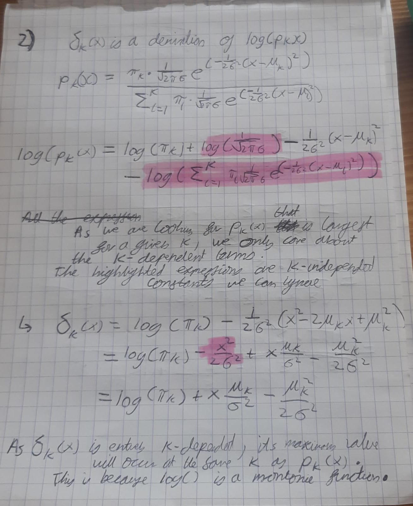
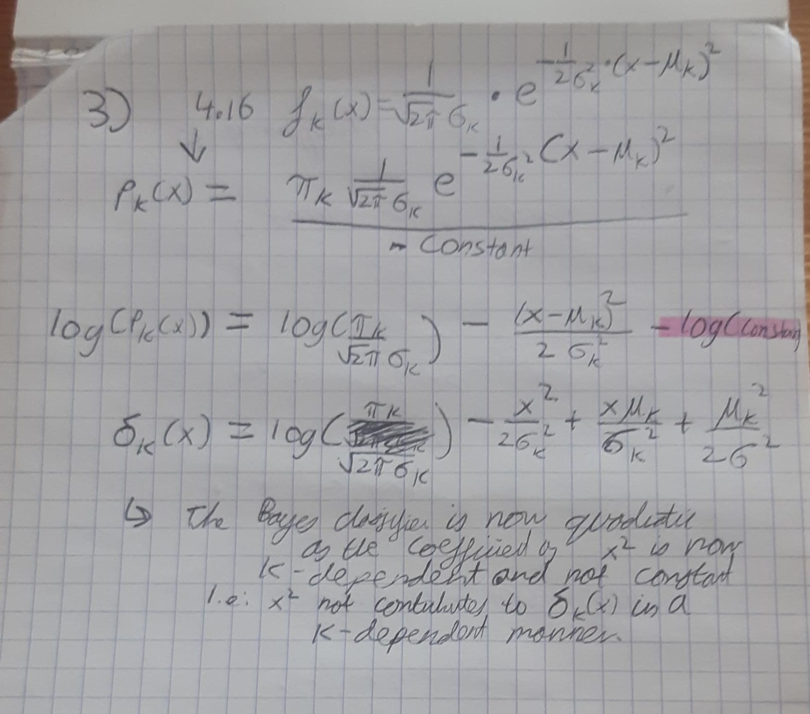
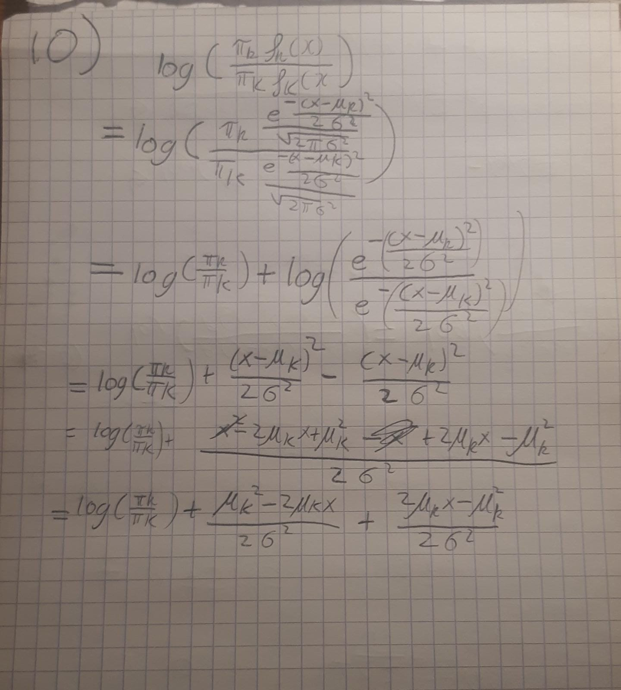
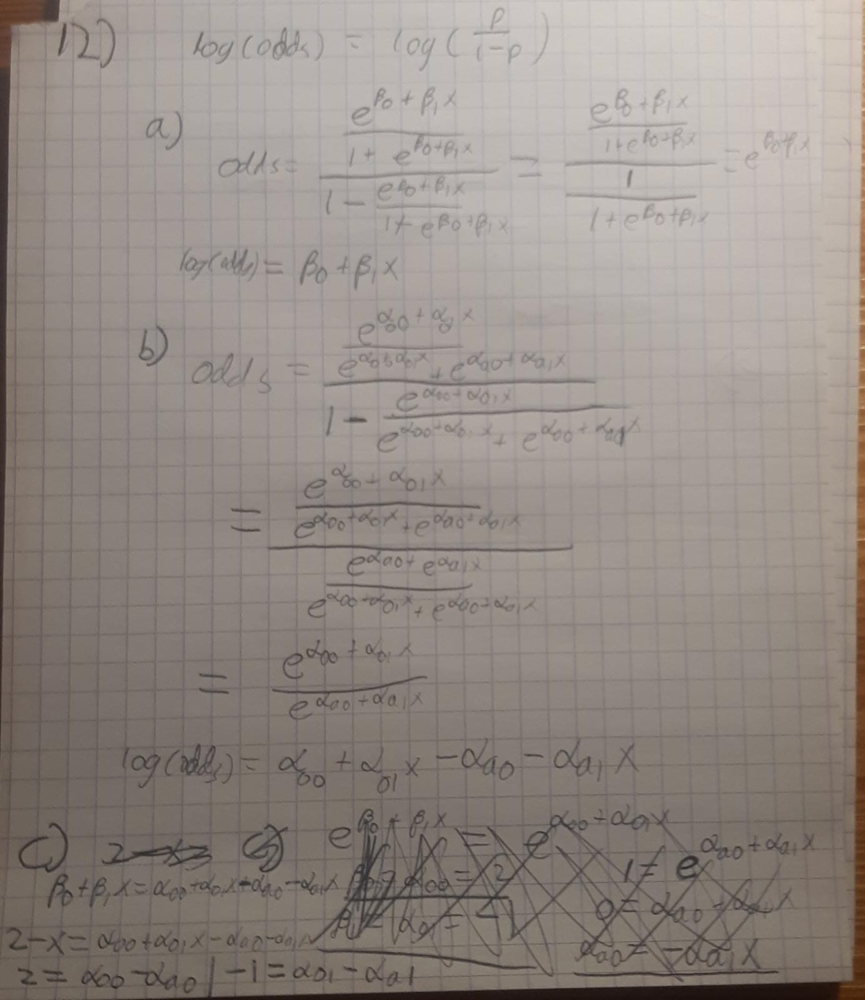
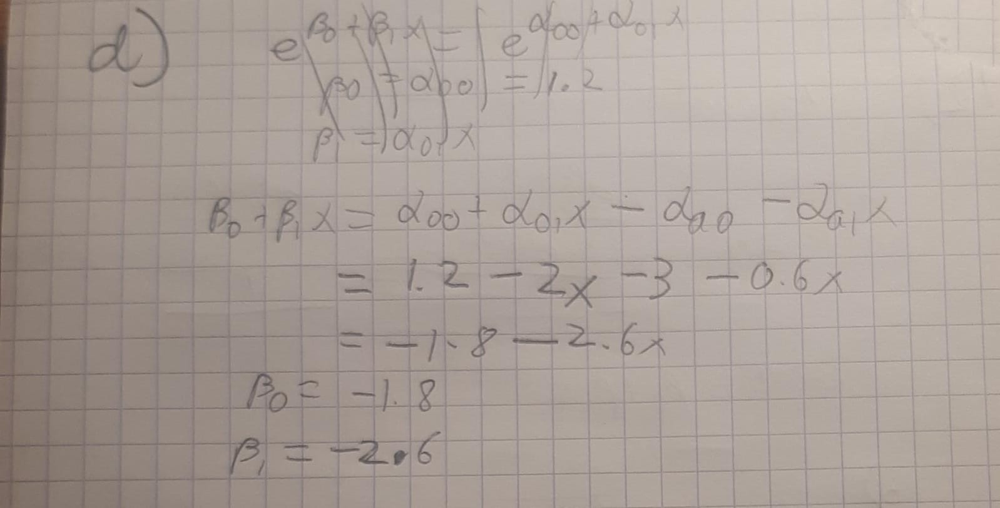

## Conceptual

1)

2)

3)

4)

5)

a) we expect QDA to perform better on the training set and LDA on the test set.
This is because QDA is more flexible and will better fit the noise of the training set. However, this will cause overfitting, leading the LDA generating a better result in the test set.

b) If non-linear, we expect QDA to outperform LDA in both cases as it will not be disadvantaged by the bias LDA will have given its assumption of linearity. The increased flexibility of QDA will therefore allow a better fit and generate a decision boundary closest to the BDB.

c) We expect this to improve QDA as the increased number of samples will reduce the contribution of noise to the model fitting and reduce the risk of overfitting.

d) False. This may only work if there is a sufficient number of observations to prevent overfitting with the QDA approach. If this is not the case, QDA will most likely start fitting the noise of the data whereas LDA will not have this issue due to its reduced flexibility.
 

6) 

7)

P(Yes | X = 4)

--> As X is normally distributed, we can use LDA with p = 1
pi_yes = 0.8
mean_yes = 10
mean_no = 0
var = 36

calculate Pk(x = 4) with k = Yes using LDA for p = 1
--> pk(4) = 0.752

8)
  As the KNN classifier uses k = 1, the training error rate is 0% as the classifier
  simply returns the same observation as the NN. Therefore, for the average to be
  18%, the test error rate must be 36%, meaning the logistic regression model is more accurate.
  
9) 

  a) 
    odds =  p(x)/p(!x)
    0.27
  b)
    0.16/0.84 = 0.19

10) Incomplete, need to confirm this answer

11) Need to come back to this
  
12)

## Applied

    
       

